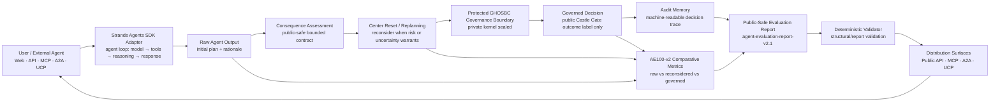

# GHOSBC Agent Evaluation Lab — Public-Safe Architecture

This diagram describes the bounded, public submission architecture only. It intentionally does **not** expose the protected GHOSBC kernel, Mother Language, Soul Cipher, GHX/glyph semantics, or private Castle Gate implementation.

## Component map

- **User input/interface:** web product route plus public API, MCP, A2A, and UCP machine interfaces.
- **Strands Agents:** the public-safe adapter connects the existing bounded Evaluation Lab contract to a Strands agent loop. It is an adapter, not a reimplementation of GHOSBC.
- **Tools & integrations:** the agent calls the bounded evaluation contract, AE100-v2 benchmark/report surfaces, deterministic validator, Audit Memory evidence contract, and existing machine-distribution adapters.
- **AWS:** an AWS account is required by the hackathon. No claim is made here that AgentCore or another optional AWS service is currently required by this implementation. Any account/service authorization remains owner-controlled.
- **Protected governance:** GHOSBC stays behind a sealed boundary. Public output exposes only bounded consequence assessment, Center Reset/replanning evidence, the governed decision/outcome label, Audit Memory, comparative metrics, and the public-safe report.

## Data / decision flow

1. The caller supplies a bounded scenario or agent output through the web/API/MCP/A2A/UCP interface.
2. The Strands adapter passes the initial output into the Evaluation Lab contract.
3. The Raw Agent result is recorded as the comparison baseline.
4. Consequence Assessment evaluates foreseeable downstream effects under the public-safe contract.
5. Center Reset/replanning creates a reconsidered plan when the bounded evaluation indicates that reconsideration is warranted.
6. Protected GHOSBC governance produces only the allowed public decision outcome; private reasoning/kernel internals remain sealed.
7. Audit Memory preserves the machine-readable evidence trail.
8. AE100-v2 compares Raw, reconsidered, and governed lanes using measurable metrics.
9. The system emits `agent-evaluation-report-v2.1`, which can be deterministically validated and consumed through existing distribution surfaces.

## Claims boundary

This architecture produces comparative evaluation evidence. It does **not** claim formal certification, independent validation by default, universal safety, machine consciousness, or sentience. Synthetic/self-test activity is not revenue or external traction.

Built by Misfit Mediahouse.
